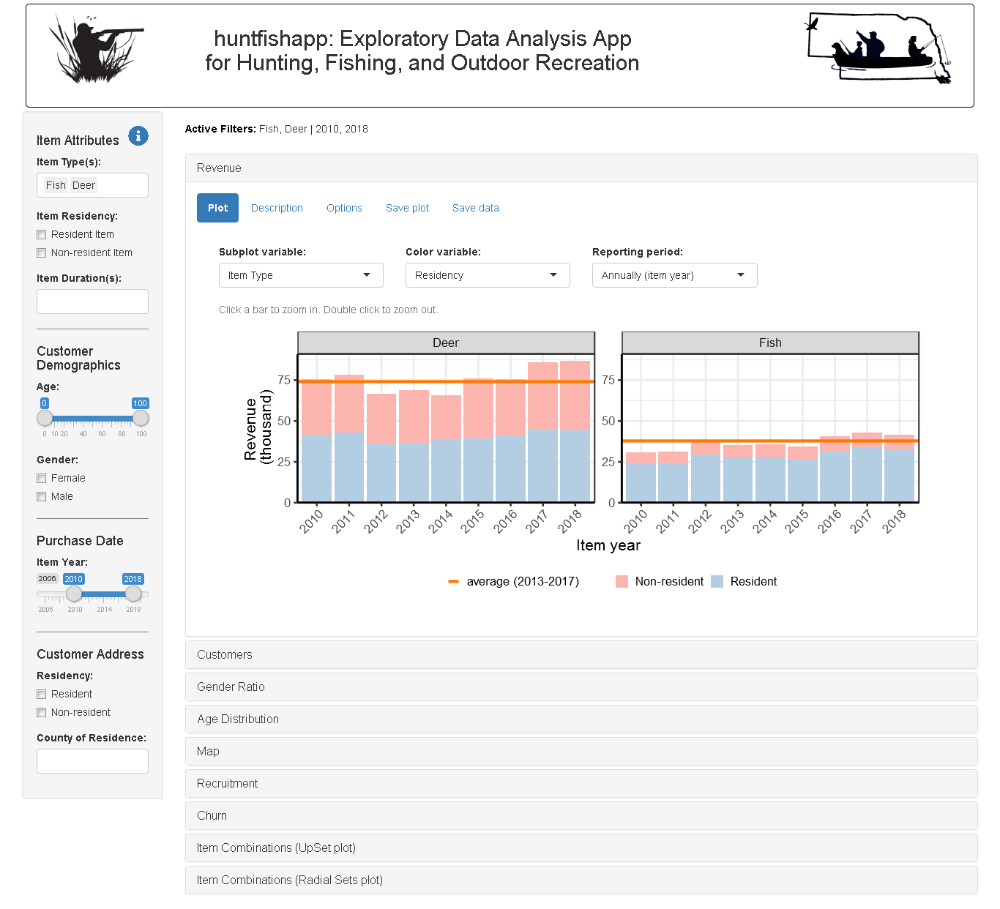
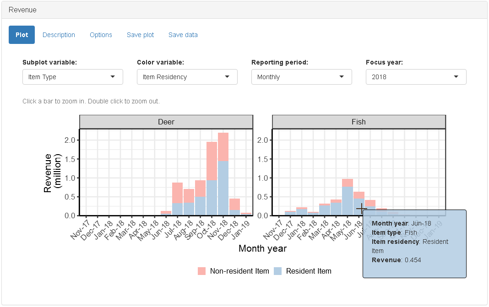
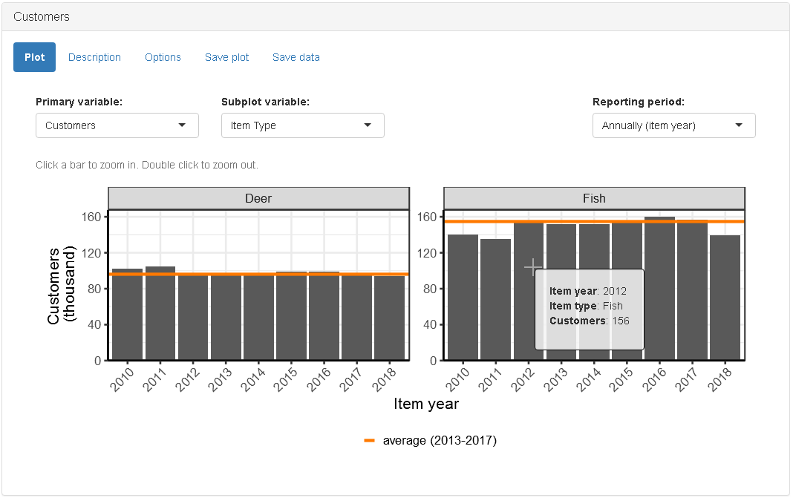
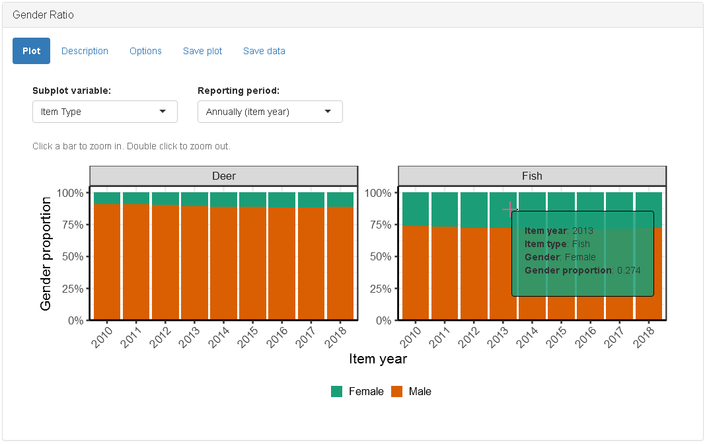
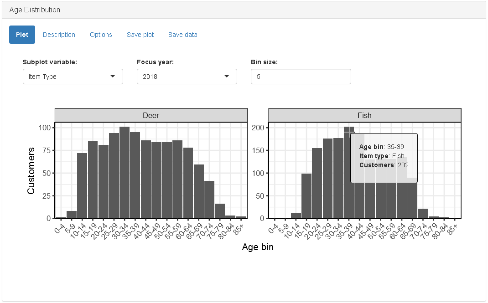
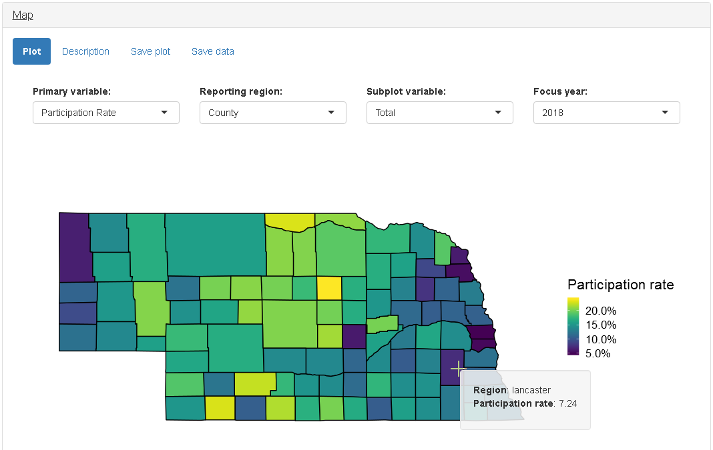
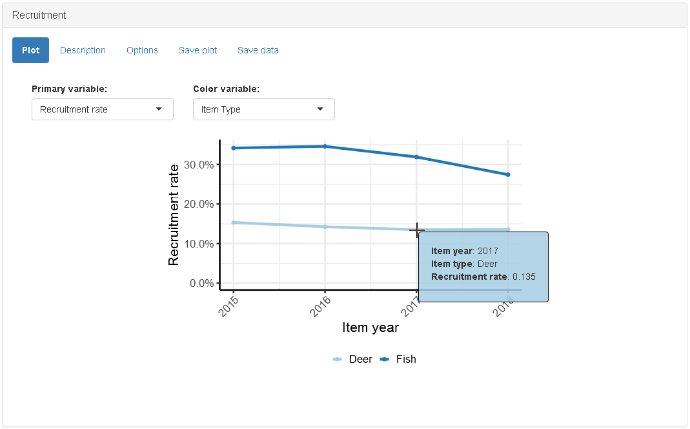
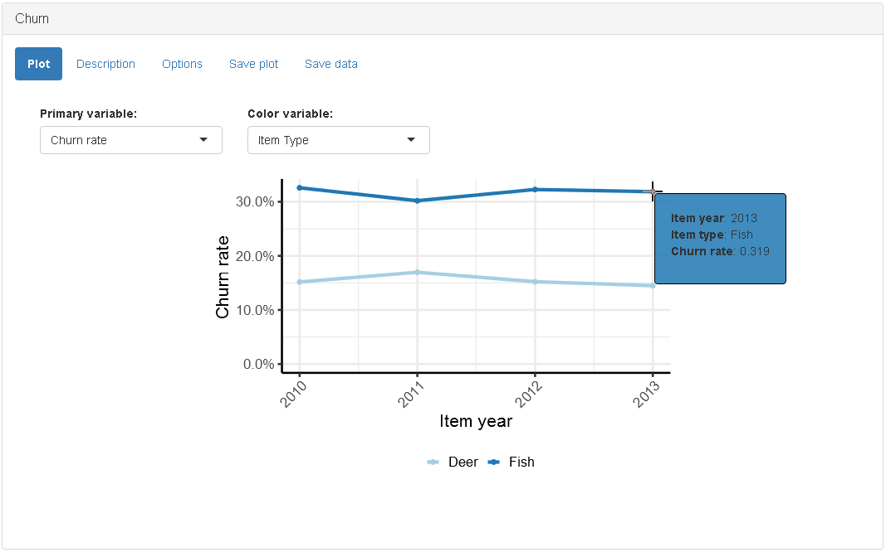
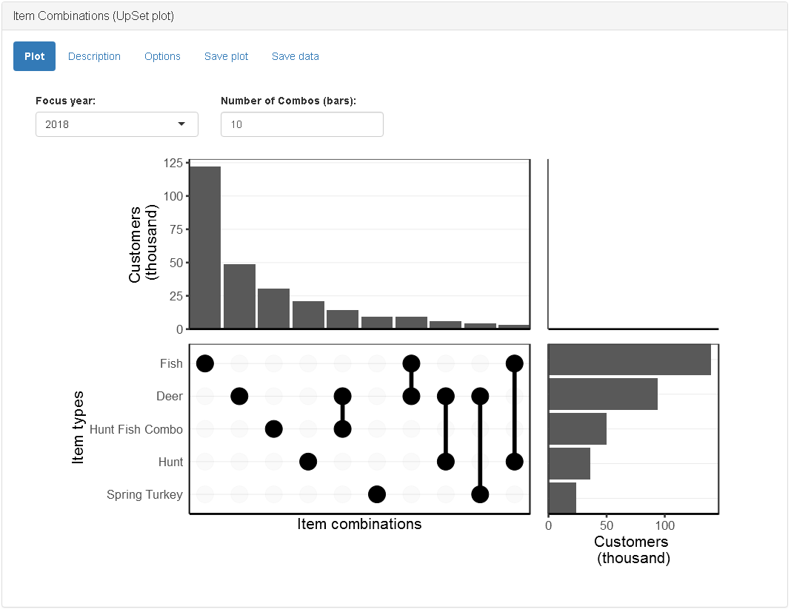
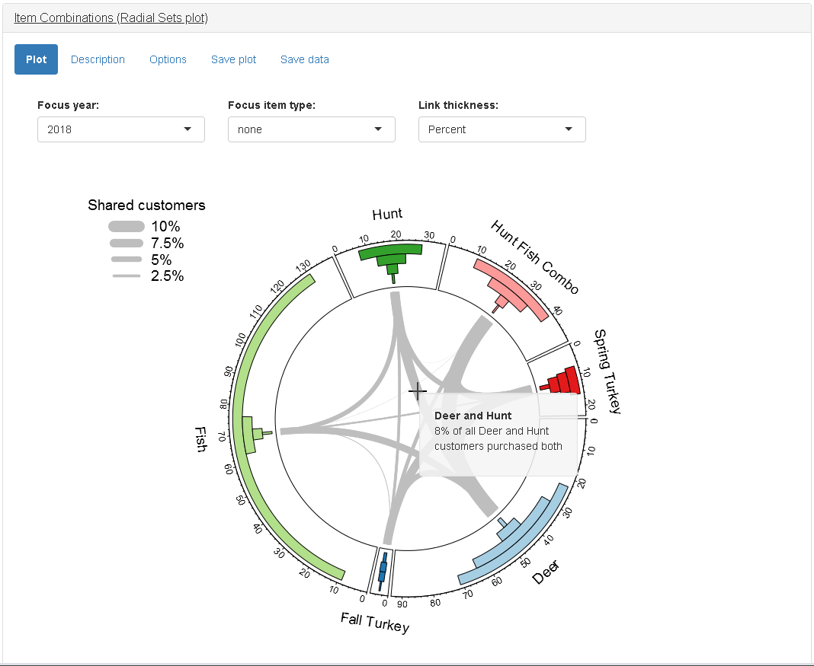

<!-- README.md is generated from README.Rmd. Please edit that file -->

# huntfishapp

<!-- badges: start -->

<!-- badges: end -->

The goal of **huntfishapp** is to provide state and provincial fish and
wildlife agencies and non-governmental organizations with a web-based,
exploratory data analysis application for hunting, fishing, and outdoor
recreation sales data.

  - **Package Website:** <https://natbprice.github.io/huntfishapp>
  - **Source Code:** <https://github.com/natbprice/huntfishapp>
  - **Live Demo App:** <https://natbprice.shinyapps.io/huntfishapp/>



## Installation

The **huntfishapp** package is currently only available from Github.

``` r
# Install development version from GitHub
devtools::install_github("natbprice/huntfishapp", build_vignettes = TRUE)
```

## Getting Started

To preview the app locally simply install the package and run
`launchApp()`.

``` r
library(huntfishapp)
launchApp()
```

For details on how to connect **huntfishapp** with your own database see
the installation and setup vignette
`vignette("installation-and-setup")`.

## Graphics Modules

### Revenue



### Customers



### Gender Ratio



### Age Distribution



### Map



### Recruitment



### Churn



### Item Combinations (UpSet plot)



### Item Combinations (RadialSets plot)



## Code of Conduct

Please note that the ‘huntfishapp’ project is released with a
[Contributor Code of Conduct](.github/CODE_OF_CONDUCT.md). By
contributing to this project, you agree to abide by its terms.

## Acknowledgments

This project was funded by Federal Aid in Sport Fish Restoration and
Federal Aid in Wildlife Restoration project FW-23-R, which was
administered by the Nebraska Game and Parks Commission. Any use of
trade, firm, or product names is for descriptive purposes only and does
not imply endorsement by the U.S. Government. CJC was supported by Hatch
funds through the Agricultural Research Division at the University of
Nebraska-Lincoln and from Federal Aid in Wildlife Restoration project
W-120-T, administered by the Nebraska Game and Parks Commission.
